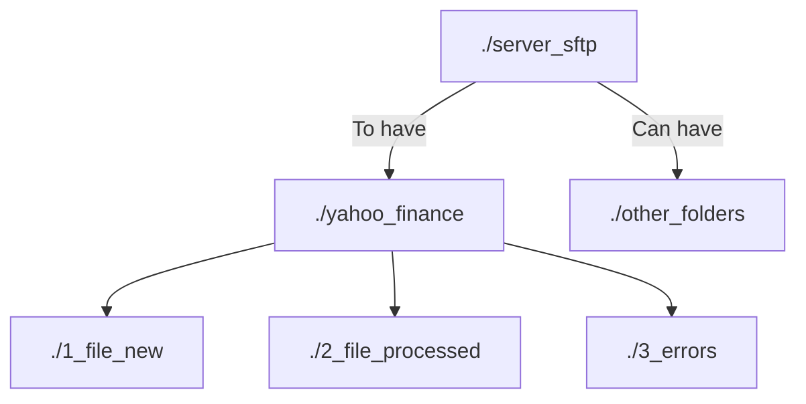
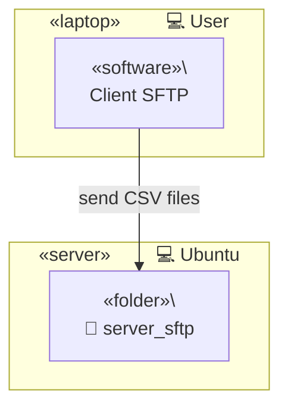
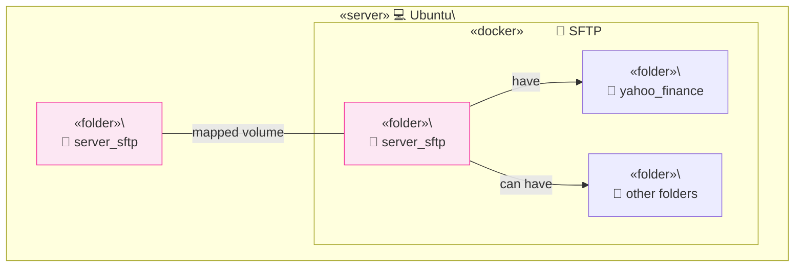
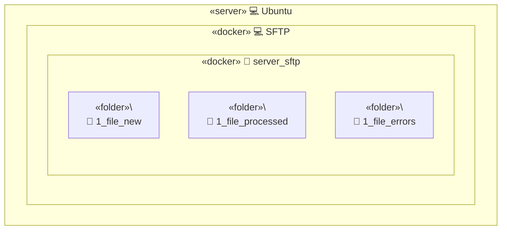
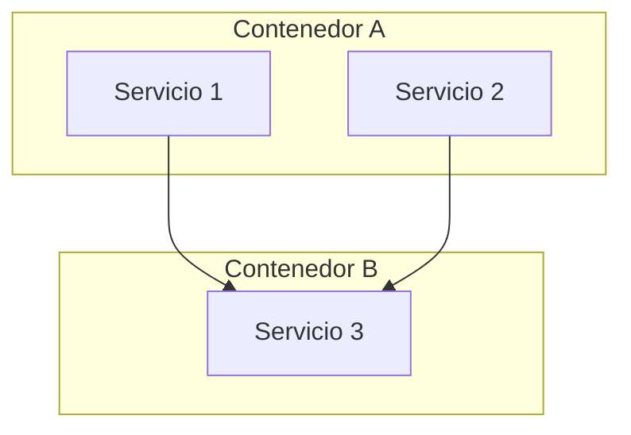
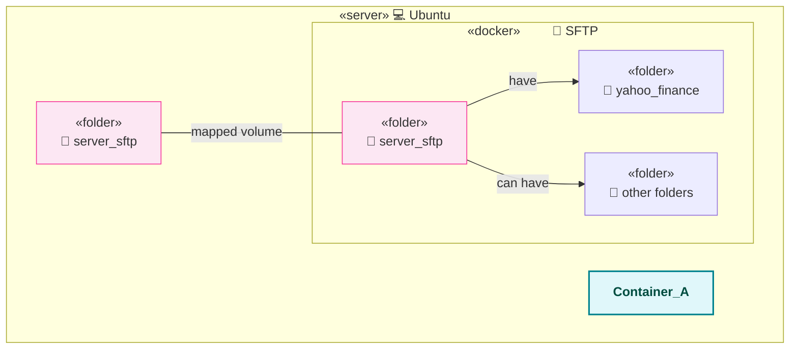

# SFTP Server

```mermaid
graph TD
    A[./server_sftp] -- To have --> B[./yahoo_finance]
    A -- Can have --> C[./other_folders]
    B --> D[./1_file_new]
    B --> E[./2_file_processed]
    B --> F[./3_errors]
```

## Other

```mermaid
graph TD
    
    subgraph Container_A [«laptop»&nbsp;&nbsp;&nbsp;&nbsp;&nbsp;&nbsp;&nbsp;&nbsp;&nbsp;💻 User]
        A1[«software»\<br> Client SFTP]
    end

    subgraph Container_B [«server»&nbsp;&nbsp;&nbsp;&nbsp;&nbsp;&nbsp;&nbsp;&nbsp;&nbsp;💻 Ubuntu]
        B1[«folder»\<br/> 📂 server_sftp]
    end
    
    A1 -- send CSV files --> B1
```

## Otro

```mermaid
graph TD
    subgraph Container_A [«server» 💻 Ubuntu\<br/>]
        A1[«folder»\<br/> 📂 server_sftp]
        A1:::note_a1
        subgraph Container_B [«docker»&nbsp;&nbsp;&nbsp;&nbsp;&nbsp;&nbsp;&nbsp;&nbsp;&nbsp;🔵 SFTP]
            B1[«folder»\<br/> 📂 server_sftp]
            B1:::note_b1
            B2[«folder»\<br/> 📂 yahoo_finance]
            B3[«folder»\<br/> 📂 other folders]
        end

        A1 -- mapped volume --- B1

        B1 -- have --> B2
        B1 -- can have --> B3

        classDef note_a1 fill:#fce7f3,stroke:#f6339a,stroke-width:1px;
        classDef note_b1 fill:#fce7f3,stroke:#f6339a,stroke-width:1px;
    end
```

## Other

```mermaid
graph TD
    subgraph Container_A [«server» 💻 Ubuntu]
        subgraph Container_B [«docker» 💻 SFTP]
            subgraph Container_C [«docker» 📂 server_sftp]
                C1[«folder»\<br/> 📂 1_file_new]
                C2[«folder»\<br/> 📂 1_file_processed]
                C3[«folder»\<br/> 📂 1_file_errors]
            end
        end
    end
```

## Aprendiendo mermad

```mermaid
graph TB
    subgraph Contenedor_A [Contenedor A]
        A1[Servicio 1]
        A2[Servicio 2]
    end

    subgraph Contenedor_B [Contenedor B]
        B1[Servicio 3]
    end

    A1 --> B1
    A2 --> B1
```

```mermaid
graph TD
    subgraph Container_A [«server» 💻 Ubuntu<br/>]
        titleA["Container_A"]:::title_style
        A1[«folder»<br/> 📂 server_sftp]:::note_a1

        subgraph Container_B [«docker»&nbsp;&nbsp;&nbsp;&nbsp;&nbsp;&nbsp;&nbsp;&nbsp;&nbsp;🔵 SFTP]
            B1[«folder»<br/> 📂 server_sftp]:::note_b1
            B2[«folder»<br/> 📂 yahoo_finance]
            B3[«folder»<br/> 📂 other folders]
        end

        A1 -- mapped volume --- B1
        B1 -- have --> B2
        B1 -- can have --> B3
    end

    classDef note_a1 fill:#fce7f3,stroke:#f6339a,stroke-width:1px;
    classDef note_b1 fill:#fce7f3,stroke:#f6339a,stroke-width:1px;
    classDef title_style fill:#e0f7fa,color:#004d40,stroke:#00838f,stroke-width:2px,font-weight:bold;
```

