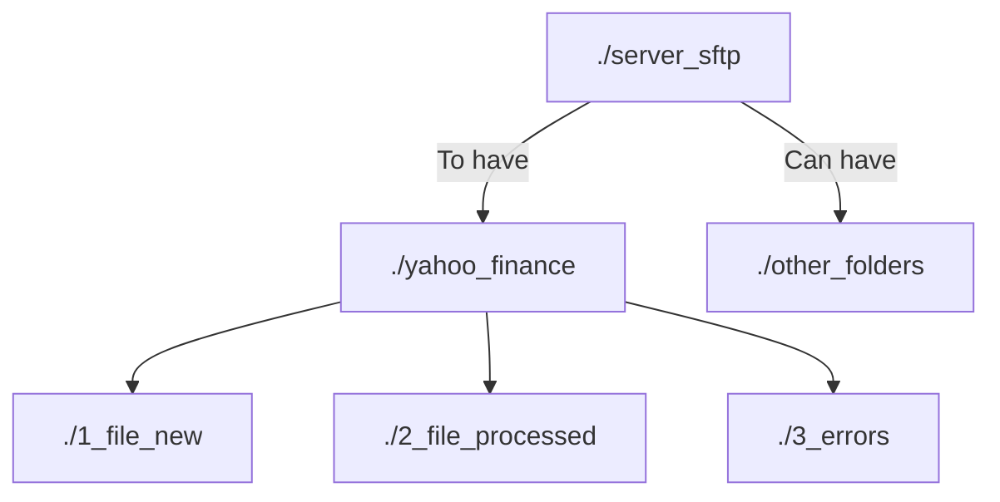

# SFTP Server



## Aprendiendo mermad

```memarid
graph TB
    subgraph Contenedor_A [Contenedor A]
        A1[Servicio 1]
        A2[Servicio 2]
    end

    subgraph Contenedor_B [Contenedor B]
        B1[Servicio 3]
    end

    A1 --> B1
    A2 --> B1
```


