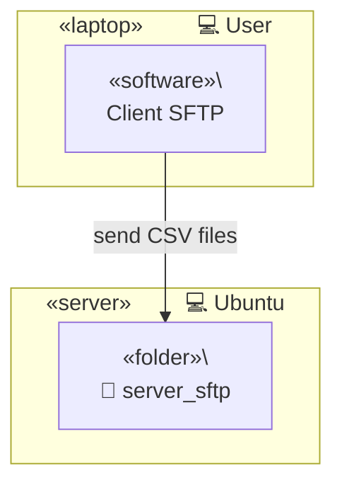
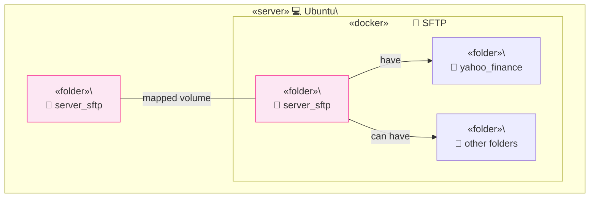
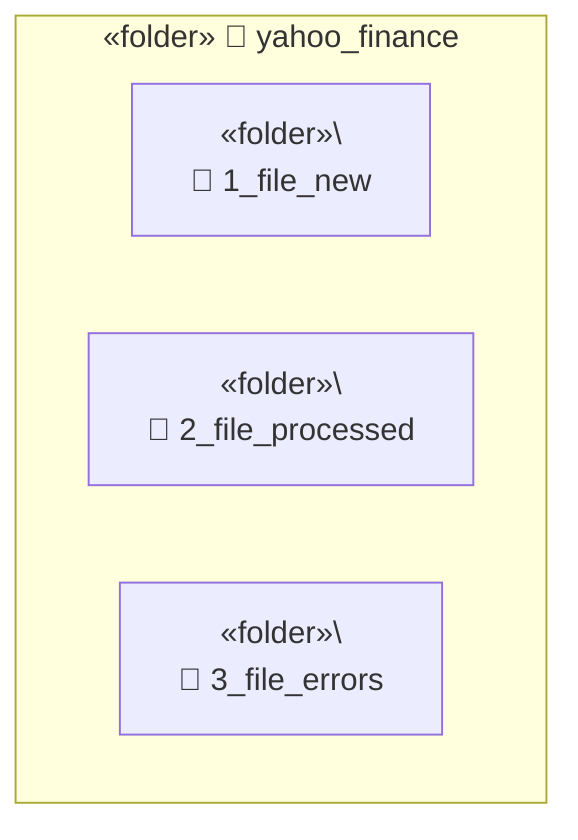
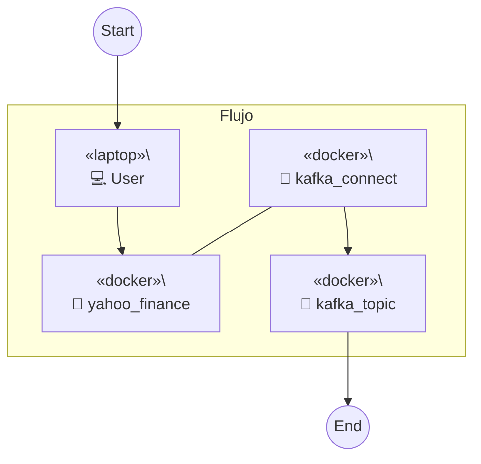

# SFTP Server

## Other

```mermaid
graph TD
    
    subgraph Container_A [«laptop»&nbsp;&nbsp;&nbsp;&nbsp;&nbsp;&nbsp;&nbsp;&nbsp;&nbsp;💻 User]
        A1[«software»\<br> Client SFTP]
    end

    subgraph Container_B [«server»&nbsp;&nbsp;&nbsp;&nbsp;&nbsp;&nbsp;&nbsp;&nbsp;&nbsp;💻 Ubuntu]
        B1[«folder»\<br/> 📂 server_sftp]
    end
    
    A1 -- send CSV files --> B1
```

## Otro

```mermaid
graph TD
    subgraph Container_A [«server» 💻 Ubuntu\<br/>]
        A1[«folder»\<br/> 📂 server_sftp]
        A1:::note_a1
        subgraph Container_B [«docker»&nbsp;&nbsp;&nbsp;&nbsp;&nbsp;&nbsp;&nbsp;&nbsp;&nbsp;🔵 SFTP]
            B1[«folder»\<br/> 📂 server_sftp]
            B1:::note_b1
            B2[«folder»\<br/> 📂 yahoo_finance]
            B3[«folder»\<br/> 📂 other folders]
        end

        A1 -- mapped volume --- B1

        B1 -- have --> B2
        B1 -- can have --> B3

        classDef note_a1 fill:#fce7f3,stroke:#f6339a,stroke-width:1px;
        classDef note_b1 fill:#fce7f3,stroke:#f6339a,stroke-width:1px;
    end
```

## Other

```mermaid
graph TB
    subgraph Container_A [«folder» 📂 yahoo_finance]
        A1[«folder»\<br/> 📂 1_file_new]
        A2[«folder»\<br/> 📂 2_file_processed]
        A3[«folder»\<br/> 📂 3_file_errors]
    end
```

## Other

```mermaid
graph TD
    subgraph Container_A [Flujo]
        A[«laptop»\<br/> 💻 User]
        B[«docker»\<br/> 📂 yahoo_finance]
        C[«docker»\<br/> 🔵 kafka_connect]
        D[«docker»\<br/> 🔵 kafka_topic]
    end

    Start((Start)) --> A
    A --> B
    C --- B
    C --> D
    D --> End((End))
```

