```mermaid
graph TB
    subgraph Container_A [«folder» 📂 yahoo_finance]
        A1[«folder»\<br/> 📂 1_file_new]
        A2[«folder»\<br/> 📂 2_file_processed]
        A3[«folder»\<br/> 📂 3_file_errors]
    end
```

```mermaid
graph TD
    subgraph Container_A [.]
        A[«1 laptop»\<br/> 💻 User]
        B[«2 docker»\<br/> 💻 sftp_server]
        C[«3 docker»\<br/> 🔵 kafka_connect]
        C:::note_c
        D[«4 docker»\<br/> 🔵 kafka_topic]
        D:::note_d
        E[«5 docker»\<br/> 🔵 microservice]
        E:::note_e
        F[«6 docker»\<br/> 🔵 database]
        F:::note_f
    end

    Start((Start)) --> A
    A --> B
    B --> C
    C --> D
    D --> E
    E --> F
    F --> End((End))

    classDef note_c fill:#fce7f3,stroke:#f6339a,stroke-width:1px;
    classDef note_d fill:#fce7f3,stroke:#f6339a,stroke-width:1px;
    classDef note_e fill:#fce7f3,stroke:#f6339a,stroke-width:1px;
    classDef note_f fill:#fce7f3,stroke:#f6339a,stroke-width:1px;
```

```mermaid
graph TD
    subgraph Container_A [«server» 💻 Ubuntu\<br/>]
        A1[«folder»\<br/> 📂 server_sftp]
        A1:::note_a1

        subgraph Container_B [«docker»&nbsp;&nbsp;&nbsp;&nbsp;&nbsp;&nbsp;&nbsp;&nbsp;&nbsp;🔵 SFTP]
            B1[«folder»\<br/> 📂 server_sftp]
            B1:::note_b1
            B2[«folder»\<br/> 📂 yahoo_finance]
        end

        subgraph Container_C [«docker»&nbsp;&nbsp;&nbsp;&nbsp;&nbsp;🔵 Kafka_Connect]
            C1[«service»\<br/> SFTP Source Connector]
        end

        A1 -- mapped volume --- B1
        B1 --> B2
        B2 --- C1

        classDef note_a1 fill:#fce7f3,stroke:#f6339a,stroke-width:1px;
        classDef note_b1 fill:#fce7f3,stroke:#f6339a,stroke-width:1px;
    end
```

# SFTP Server

Detail of the SFTP server implementation in Docker, as well as an overview from the perspective of the solution architecture and the process flow of this part of the application.

- [Introduction](#introduction)
- [Server Architecture with Docker and Volumes](#server-architecture-with-docker-and-volumes)

## Introduction

From the `Data Street` project, functionality is provided that allows a personal computer, using an SFTP client, to connect to the application's SFTP server and upload files in `CSV` format. These files will later be processed by other components defined in the application's architecture, which will be reviewed in detail in other sections.

```mermaid
graph TD
    
    subgraph Container_A [«laptop»&nbsp;&nbsp;&nbsp;&nbsp;&nbsp;&nbsp;&nbsp;&nbsp;&nbsp;💻 User]
        A1[«software»\<br> Client SFTP]
    end

    subgraph Container_B [«server»&nbsp;&nbsp;&nbsp;&nbsp;&nbsp;&nbsp;&nbsp;&nbsp;&nbsp;💻 Ubuntu]
        B1[«folder»\<br/> 📂 server_sftp]
    end
    
    A1 -- upload CSV files --> B1
```

## Server Architecture with Docker and Volumes

```mermaid
graph TD
    subgraph Container_A [«server» 💻 Ubuntu\<br/>]
        A1[«folder»\<br/> 📂 server_sftp]
        A1:::note_a1
        subgraph Container_B [«docker»&nbsp;&nbsp;&nbsp;&nbsp;&nbsp;&nbsp;&nbsp;&nbsp;&nbsp;🔵 SFTP]
            B1[«folder»\<br/> 📂 server_sftp]
            B1:::note_b1
            B2[«folder»\<br/> 📂 yahoo_finance]
            B3[«folder»\<br/> 📂 other folders]
        end

        A1 -- mapped volume --- B1

        B1 -- have --> B2
        B1 -- can have --> B3

        classDef note_a1 fill:#fce7f3,stroke:#f6339a,stroke-width:1px;
        classDef note_b1 fill:#fce7f3,stroke:#f6339a,stroke-width:1px;
    end
```

## Other

## Other

## Other

