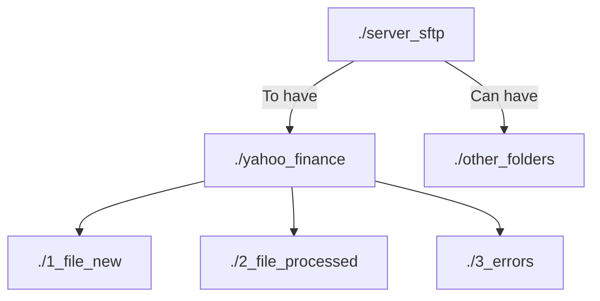
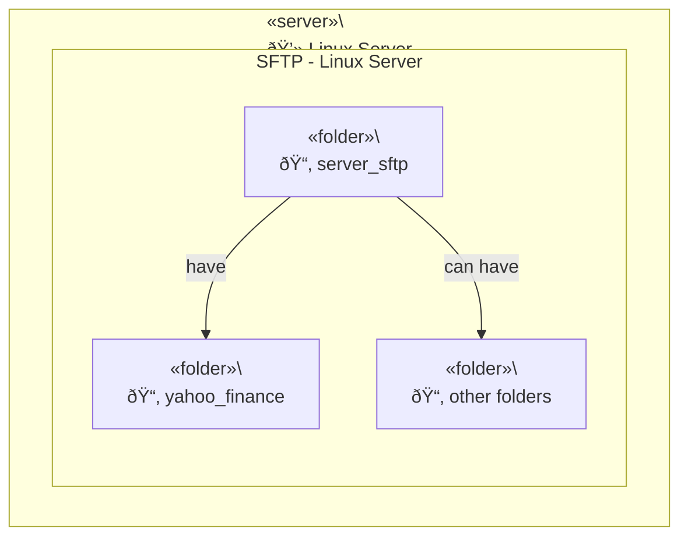
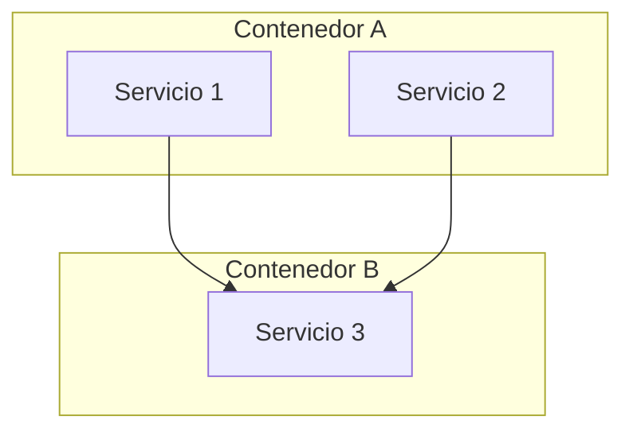

# SFTP Server

```mermaid
graph TD
    A[./server_sftp] -- To have --> B[./yahoo_finance]
    A -- Can have --> C[./other_folders]
    B --> D[./1_file_new]
    B --> E[./2_file_processed]
    B --> F[./3_errors]
```

## Otro

```mermaid
graph TD
    subgraph Container_A [&laquo;server&raquo;\<br/> 💻 Linux Server]
        subgraph Contenedor_A [SFTP - Linux Server]
            A1[&laquo;folder&raquo;\<br/> 📂 server_sftp]
            A2[&laquo;folder&raquo;\<br/> 📂 yahoo_finance]
            A3[&laquo;folder&raquo;\<br/> 📂 other folders]
        end

        A1 -- have --> A2
        A1 -- can have --> A3
    end
```

## Aprendiendo mermad

```mermaid
graph TB
    subgraph Contenedor_A [Contenedor A]
        A1[Servicio 1]
        A2[Servicio 2]
    end

    subgraph Contenedor_B [Contenedor B]
        B1[Servicio 3]
    end

    A1 --> B1
    A2 --> B1
```

